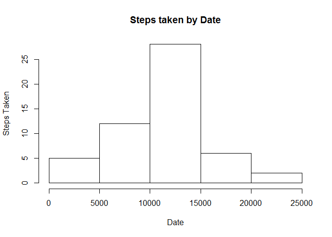
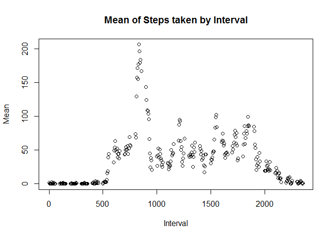
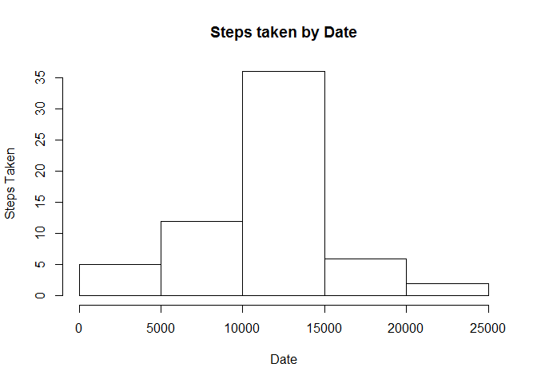
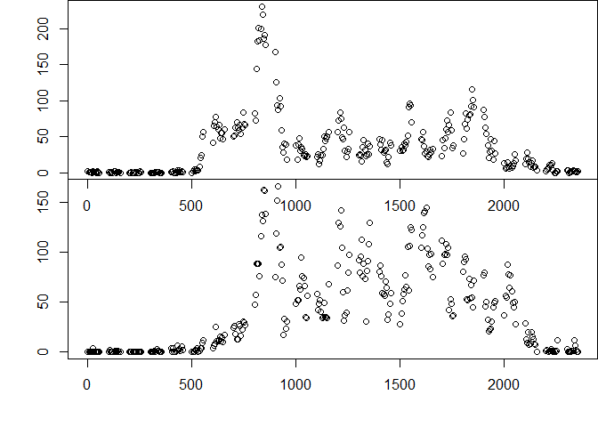

#Excercise Activity Analysis
By Frank Pinto
---

##Reading in and cleaning the Data

```r
dat <- read.csv("activity.csv")
cdat <- dat[complete.cases(dat),]
library(plyr)
library(dplyr)
```

```
## 
## Attaching package: 'dplyr'
```

```
## The following objects are masked from 'package:plyr':
## 
##     arrange, count, desc, failwith, id, mutate, rename, summarise,
##     summarize
```

```
## The following objects are masked from 'package:stats':
## 
##     filter, lag
```

```
## The following objects are masked from 'package:base':
## 
##     intersect, setdiff, setequal, union
```

##Histogram

```r
sumsteps <- ddply(cdat, "date", .fun = function(x) sum(x$steps))
hist(sumsteps[,2], xlab = "Date", ylab = "Steps Taken", main = "Steps taken by Date")
```

<!-- -->

## Mean and Median of Steps taken each day

The Median is

```r
median(sumsteps[,2])
```

```
## [1] 10765
```
The Mean is

```r
mean(sumsteps[,2])
```

```
## [1] 10766.19
```

##Average pattern per day

```r
avgsteps <- ddply(cdat, "interval", .fun = function(x) mean(x$steps))
plot(x = avgsteps[,1], y = avgsteps[,2], xlab = "Interval", ylab = "Mean", main = "Mean of Steps taken by Interval")
```

<!-- -->

The Interval with the most steps taken is

```r
avgsteps[which.max(avgsteps[,2]),]
```

```
##     interval       V1
## 104      835 206.1698
```

##NAs found in the Data
The number of NAs found in the Data is

```r
sum(!complete.cases(dat))
```

```
## [1] 2304
```

Missing data will be filled with the mean for their corresponding interval

```r
a <- dat[is.na(dat),]
b <- ddply(cdat, "interval", function(x) mean(x$steps))
fread <- replace(a$steps, a$interval %in% b$interval, b$V1)
a[,1] <- fread 
dat[is.na(dat),] <- a
str(dat)
```

```
## 'data.frame':	17568 obs. of  3 variables:
##  $ steps   : num  1.717 0.3396 0.1321 0.1509 0.0755 ...
##  $ date    : Factor w/ 61 levels "2012-10-01","2012-10-02",..: 1 1 1 1 1 1 1 1 1 1 ...
##  $ interval: int  0 5 10 15 20 25 30 35 40 45 ...
```

Calculating the amount of NAs in the new DT

```r
sum(!complete.cases(dat))
```

```
## [1] 0
```

The Mean of the Steps taken by Date of the new dat DT

```r
sumsteps <- ddply(dat, "date", .fun = function(x) sum(x$steps))
mean(sumsteps$V1)
```

```
## [1] 10766.19
```
The Median of the Steps taken by Date of the new dat DT

```r
median(sumsteps$V1)
```

```
## [1] 10766.19
```
The Histogram of the Steps taken by Date of the new dat DT

```r
hist(sumsteps[,2], xlab = "Date", ylab = "Steps Taken", main = "Steps taken by Date")
```

<!-- -->

Given the changes in the dat DT the mean went up by 1 step, while the median remained the same. The Histogram showed notorious change in the highest bar of aprox 10.

##Weekdays vs. Weekends

Setting the Date column as factors

```r
dat$date <- weekdays(as.Date(dat$date))
dat$date <- as.factor(dat$date)
str(dat$date)
```

```
##  Factor w/ 7 levels "domingo","jueves",..: 3 3 3 3 3 3 3 3 3 3 ...
```

```r
dat$date <- revalue(dat$date, c("domingo"="Weekend", "sábado"="Weekend"))
dat$date <- revalue(dat$date, c("lunes"="Weekday", "martes"="Weekday", "miércoles"="Weekday", "jueves"="Weekday", "viernes"="Weekday"))
str(dat)
```

```
## 'data.frame':	17568 obs. of  3 variables:
##  $ steps   : num  1.717 0.3396 0.1321 0.1509 0.0755 ...
##  $ date    : Factor w/ 2 levels "Weekend","Weekday": 2 2 2 2 2 2 2 2 2 2 ...
##  $ interval: int  0 5 10 15 20 25 30 35 40 45 ...
```

Plot of steps taken in each interval during Weekends (bottom) and Weekdays (top)

```r
a <- a <- dat[dat$date == "Weekday",]
a <- ddply(a, "interval", function(x) mean(x$steps))
b <- dat[dat$date == "Weekend",]
b <- ddply(b, "interval", function(x) mean(x$steps))
par(mfrow = c(2,1))
par(mar = c(0,0,0,0), oma = c(4,4,0,0))
plot(x = a$interval, y = a$V1)
plot(x = b$interval, y = b$V1)
```

<!-- -->
